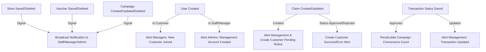

# Backend Developer Reference (Robinson Mall API)

This document provides a technical overview of the Robinson Mall backend architecture, built using **Django 6**, **Django REST Framework (DRF)**, and **SQLite** (configured for production-grade concurrency via WAL mode and row-level locking).

---

## 1. Database Schema & Data Models (`api/models.py`)

Below is the database structure, detailing foreign key constraints, field validations, and custom model methods.

### User
Extends Django's `AbstractUser` to support email-based authentication and role-based permissions.
* **Fields**:
  - `email` (EmailField, unique=True, blank=False): Used as the primary login identifier.
  - `role` (CharField, choices=`admin`, `manager`, `staff`, `customer`, default=`customer`): Enforces RBAC.
  - `phone_number` (CharField, max_length=15, default=''): Contact number.
  - `birthday` (DateField, null=True, blank=True): Age-based verification/demographics.
  - `password_reset_token` (CharField, max_length=100, null=True, blank=True): Stores password-reset references.
* **Custom Manager**: `CustomUserManager` replaces the default to authenticate using `email` instead of `username`.
* **String Representation**: Returns the user's `email`.

### Store
Represents physical merchants located within the mall.
* **Fields**:
  - `name` (CharField, max_length=100, default='New Store'): Merchant name.
  - `location` (CharField, max_length=255, default=''): Store location/suite number.
  - `created_at` (DateTimeField, auto_now_add=True): Timestamp of creation.

### Campaign
Aggregates vouchers under budgeting and scheduling limits.
* **Fields**:
  - `name` (CharField, max_length=100): Campaign name.
  - `status` (CharField, choices=`Active`, `Scheduled`, `Completed`, `Inactive`, default=`Active`).
  - `budget` (DecimalField, max_digits=15, decimal_places=2): Total financial budget.
  - `spending_target` (DecimalField, max_digits=15, decimal_places=2, default=0): Projected spend target.
  - `start_date` (DateField): Start of campaign activity.
  - `end_date` (DateField): Campaign expiration date.
  - `reach` (IntegerField, default=0): Legacy reach field (replaced in dashboards by live-computed distinct customer claims).
  - `conversions` (IntegerField, default=0): Total approved voucher transactions.

### Voucher
Discount templates associated with campaigns and optionally assigned to specific stores.
* **Fields**:
  - `name` (CharField, max_length=100): Descriptive name.
  - `code` (CharField, unique=True, max_length=50): Unique voucher code.
  - `voucher_type` (CharField, choices=Fashion, Food & Beverage, Beauty, etc.): Classification.
  - `discount_percentage` (IntegerField, choices=[5, 10, 15, 20, 25, 30, 50]): Discount amount.
  - `usage_limit` (IntegerField): Maximum claim allocation limit.
  - `usage_count` (IntegerField, default=0): Current claimed count.
  - `is_active` (BooleanField, default=True): Manual override to disable a voucher.
  - `campaign` (ForeignKey, Campaign, on_delete=PROTECT): Prevents campaign deletion while vouchers are active.
  - `store` (ForeignKey, Store, on_delete=SET_NULL, null=True, blank=True): Links voucher to a store.

### Claim
Records customer allocations of vouchers.
* **Fields**:
  - `user` (ForeignKey, User, on_delete=CASCADE): The claiming customer.
  - `voucher` (ForeignKey, Voucher, on_delete=CASCADE): The targeted voucher.
  - `store` (ForeignKey, Store, on_delete=SET_NULL, null=True): Redeemable merchant.
  - `receipt_no` (CharField, default=''): Customer invoice/receipt reference.
  - `amount` (DecimalField, max_digits=10, decimal_places=2, default=0): Total purchase amount.
  - `status` (CharField, choices=`Pending`, `Approved`, `Rejected`, default=`Pending`).
  - `claim_ref` (CharField, unique=True, db_index=True): Formatted unique reference code (`{INITIALS}-{NAME}+{UUID8}`).
* **Custom Save Hook**: Generates a collision-resistant `claim_ref` on first insert. It retries up to 5 times if collisions occur before defaulting to a long fallback.

### Transaction
The auditing engine. Stores de-normalized records of voucher redemptions.
* **Fields**:
  - `transaction_id` (CharField, unique=True): Format: `TXN-{UUID8}`.
  - `user` (ForeignKey, User, on_delete=SET_NULL, null=True): Redeeming customer.
  - `receipt_no` (CharField, default=''): Referenced sales invoice.
  - `user_name` (CharField, default=''): Snapshot of customer name.
  - `voucher_name` (CharField, default=''): Snapshot of voucher name.
  - `voucher_code` (CharField, default=''): Snapshot of voucher code.
  - `store` (ForeignKey, Store, on_delete=SET_NULL, null=True): Redeeming store link.
  - `store_name` (CharField, default=''): Snapshot of store name.
  - `amount` (DecimalField, max_digits=10, decimal_places=2, null=True): Snapshot of transaction amount.
  - `expiry_date` (DateField, null=True): Expiry date snapshot.
  - `status` (CharField, choices=`Pending`, `Approved`, `Rejected`, `Expired`, default=`Pending`).
  - `rejection_reason` (TextField, default=''): Explanation if rejected.

### Notification
Internal alerts mapping.
* **Fields**:
  - `user` (ForeignKey, User, on_delete=CASCADE): Targeted user.
  - `target_role` (CharField, null=True): Targeted role broadcast.
  - `title` (CharField, max_length=100): Alert title.
  - `message` (TextField): Details.
  - `notification_type` (CharField, choices=`info`, `success`, `warning`, `error`, default=`info`).
  - `is_read` (BooleanField, default=False).

---

## 2. API Views & ViewSets (`api/views.py`)

Endpoints are implemented using DRF model ViewSets.

### UserViewSet
- **Permissions**: Admins manage user data. Staff can list/retrieve customer profiles. Customers modify their own profile.
- **Custom Actions**:
  - `register` (POST, AllowAny): Registers a user. Automatically enforces `role='customer'`.
  - `login` (POST, AllowAny): Authenticates via email/password. Returns SimpleJWT payload.
  - `me` (GET/PATCH, IsAuthenticated): Returns or updates profile.
    - *Security*: Restricts modifications to password complexity standards and prevents role/is_active self-escalations. Minting a new JWT is only performed during actual password updates.

### CampaignViewSet
- **Permissions**: Manager+ can write, authenticated users can read.
- **Queries & Dynamic Status Updates**:
  - Overrides `get_queryset()` to dynamically transition campaign statuses (`Scheduled` &rarr; `Active` &rarr; `Completed`) based on dates.
  - *Caching*: Gates updates behind a 1-hour cache key to prevent heavy write contention during dashboard polling.

### ClaimViewSet
- **Permissions**: Customers read their own claims and create self-service requests. Staff+ manages (CRUD) all claims.
- **Redemption & Hardening**:
  - `perform_create`: Uses `select_for_update()` to lock the voucher, preventing concurrent requests from breaching `usage_limit` or campaign budgets.
  - `redeem` (PATCH, detail=True): Approves or Rejects a claim. Locks the claim and voucher. Ensures receipt numbers are globally unique across all approved records.

### TransactionViewSet
- **Permissions**: Staff+ can perform CRUD. Customers view their own history.
- **Transitions**:
  - `update_status` (PATCH, detail=True): Handles transition to `Approved` or `Rejected`. 
  - *SQLite Concurrency*: Uses a conditional database update filter (`status='Pending'`) instead of lock queries. This provides true thread-safety in SQLite WAL mode.
  - *Cascades*: Transitioning an approved transaction to `Rejected` cascades to change the linked Claim to `Rejected` and decrements the Voucher's `usage_count`.

---

## 3. Signal Automation Details

Using Django's `post_save` and `post_delete` signals, the system triggers automated notifications and conversions recalculation:

- **`notify_management(title, message, n_type)`**: Shared helper that broadcasts notifications to all users with administrative roles (`admin`, `manager`, `staff`).
- **Conversions Re-indexing**: The transaction signal fetches all voucher codes mapped to the campaign, counts approved transactions, and saves the count directly to the `Campaign.conversions` column.
