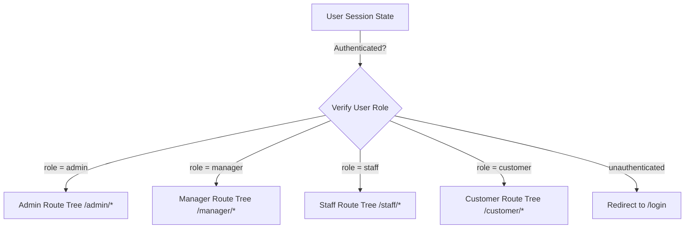

# Frontend Developer Reference (Robinson Mall SPA)

This document provides a technical overview of the React single-page application (SPA) frontend, built with **React 19**, **Vite**, and **React Router v7**.

---

## 1. Application Infrastructure & State Flow

### Root Orchestrator (`src/App.jsx`)
Defines the global React router tree, routes mapping, and user sessions.
- **Session State**: The `user` state checks persistent storage (`localStorage` for "Remember Me") and temporary storage (`sessionStorage`) to resume active sessions.
- **Session Timeout**: If a user is logged in, an `IdleTimer` component registers mouse, touch, and keyboard events, logging the user out after 5 minutes of inactivity.
- **Axios Token Interceptors**:
  - *Request Interceptor*: Automatically attaches the `accessToken` inside the `Authorization: Bearer <token>` header for outgoing API calls. It explicitly skips login and registration endpoints.
  - *Response Interceptor (JWT Rotation)*: Catches `401 Unauthorized` responses. If a `refreshToken` is available, it pauses the current call, requests a renewed access token from `/api/token/refresh/`, and retries the original request. If rotation fails or expires, it clears storage and routes the browser to `/login`.

---

## 2. Route Guarding & Protected Layouts

We use nested React Router configurations to enforce Role-Based Access Control (RBAC):

- Each role layout (`AdminLayout`, `ManagerLayout`, etc.) acts as a route guard. It redirects to `/login` if the user is unauthenticated, or to the root path `/` if they attempt to load a path of another role.

---

## 3. Key Components Breakdown

### The Barcode/QR Scanner (`RedeemVoucherPanel.jsx`)
Used by Staff/Managers to check and redeem claims via QR code scanning.
- **Ref State Machine**: Since camera streaming is asynchronous, a `cameraState` ref is used to prevent duplicate triggers:
  - `stopped`: Camera is off.
  - `starting`: Requesting browser webcam permission.
  - `scanning`: Active feed in canvas.
  - `stopping`: Releasing media stream resources.
- **Lifecycle Abort Handlers**: An effect checks if the component unmounts during active scanner setups. If the user leaves the tab or page during `starting`, the stream is aborted immediately.
- **Normalizer**: Decoded text matches numbers or hashes to look up the claim format (`CLAIM-ID`).

### Modals (`src/components/`)
- **`ActionConfirmModal.jsx`**: Generic modal containing customizable variants (`danger` for rejections, `success` for approvals).
- **`CampaignModal.jsx` & `CampaignDetailsModal.jsx`**: Used to create, edit, and read campaign data. They validate start and end dates and budget values.
- **`TransactionModal.jsx` & `Transactiondetailsmodal.jsx`**: Audit modal showing full receipt data, de-normalized metadata, status changes, and rejection reasons.
- **`VoucherModal.jsx`**: Handles voucher configurations, assigning them to stores and campaigns.

---

## 4. UI styling & Design System

The application relies on vanilla CSS stylesheets located in `/src/css/` (e.g., `App.css`, `Vouchers.css`).
* **Design Tokens**: Standardized CSS variables inside `App.css` define theme colors (e.g., `#C40000` for branding, `#1e293b` for backgrounds), font sizes, and transition curves.
* **Component-specific isolation**: Each view (such as Customer dashboard vs. Admin reports) imports its corresponding CSS module to prevent global class collisions.
* **Responsive Layouts**: Flexible grid styles and media queries ensure compatibility across desktop screens and mobile scanner devices.
